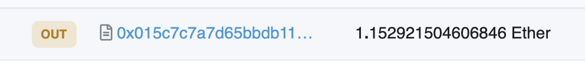
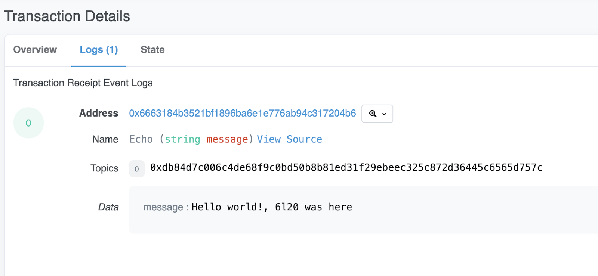

# Send an Infura ITX meta-transaction

This tutorial walks you through signing a meta-transaction with Quorum Key Manager (QKM) and sending it to Infura Transactions (ITX). This tutorial is an extension of the [Connect to an Infura endpoint tutorial](ConnectInfura.md) and uses the Rinkeby testnet.

## Prerequisites

Follow steps 1 to 5 in the [Connect to an Infura endpoint tutorial](ConnectInfura.md). This gives you an Ethereum account with a new address.

## Steps

1.  Fund your Ethereum account. For example, you can go to the [Rinkeby faucet](https://www.rinkeby.io/#faucet) and follow the instructions there. You can use Etherscan to check that the faucet gave you ETH.

1.  Deposit ETH into the Infura deposit contract using QKM `infura-node`. The following example uses the sample deposit contract `0x015C7C7A7D65bbdb117C573007219107BD7486f9`:

    <!--tabs-->

    # curl HTTP request

    ```bash
    curl --location --request POST 'https://localhost:8080/nodes/infura-node' \
        --header 'Authorization: Basic YWRtaW4tdXNlcg==' \
        --header 'Content-Type: application/json' \
        --data-raw '{"jsonrpc":"2.0","method":"eth_sendTransaction",
            "params":[
                {"from": "<MY_ETH_ACCOUNT_ADDRESS>",
                "to": "0x015C7C7A7D65bbdb117C573007219107BD7486f9",
                "gas": "0x65000",
                "gasPrice": "0x1000000000",
                "value": "0x1000000000000000"}
                ], "id":3
            }
            '
    ```

    # JSON result

    ```bash
    {
        "jsonrpc": "2.0",
        "result": "0xff1bd105d7254789b6fc5e18639e2395068108d66bcfe728e5f792295b7526be",
        "error": null,
        "id": 3
    }
    ```

    <!--/tabs-->

    The response yields the transaction hash for the successful deposit. You can use Etherscan to check that the deposit went through:

    

1.  Build a message to be sent to a test contract. In this example, the message is `Hello world!, 6l20 was here`, which translates to the following Ethereum message:

    ```text
    0xf15da7290000000000000000000000000000000000000000000000000000000000000020000000000000000000000000000000000000000000000000000000000000001b48656c6c6f20776f726c64212c20366c32302077617320686572650000000000
    ```

    The hash of the Ethereum message is:

    ```text
    bf11b3f509e51cbb52070358c5bfadd9047ee9750e865f8f1b1ad125df65e853
    ```

1.  Use QKM to sign the message hash, replacing `<MY_ETH_ACCOUNT_ADDRESS>` with your Ethereum account address:

    ```bash
    curl --location --request POST 'https://localhost:8080/stores/eth-accounts/ethereum/<MY_ETH_ACCOUNT_ADDRESS>/sign-message' \
        --header 'Authorization: Basic YWRtaW4tdXNlcg==' \
        --header 'Content-Type: application/json' \
        --data-raw '{
            "message": "0xbf11b3f509e51cbb52070358c5bfadd9047ee9750e865f8f1b1ad125df65e853"
        }'
    ```

    This gives you a valid signature, such as:

    ```text
    0xd4a7151261d815cd2720632b9e9949fd141e5059321bb8f23e621a944dd1081533acef9d1a318b3b60c2815385ba7e3ca59adee6490113c5a71913735acbeb8b1c
    ```

1.  Send the message using ITX, replacing `<YOUR_QKM_SIGNATURE>` with the signature from the previous step. In this example, the message is sent to the address `0x6663184b3521bF1896Ba6e1E776AB94c317204B6`:

    <!--tabs-->

    # curl HTTP request

    ```bash
    curl --location --request POST 'https://rinkeby.infura.io/v3/d23bcbc0d01e422b81fb118544fbd7af' \
        --header 'Content-Type: application/json' \
        --data-raw '{
            "jsonrpc": "2.0",
            "method": "relay_sendTransaction",
            "params": [
                {
                    "to": "0x6663184b3521bF1896Ba6e1E776AB94c317204B6",
                    "data": "0xf15da7290000000000000000000000000000000000000000000000000000000000000020000000000000000000000000000000000000000000000000000000000000001b48656c6c6f20776f726c64212c20366c32302077617320686572650000000000",
                    "gas": "100000",
                    "schedule": "fast"
                }, "<YOUR_QKM_SIGNATURE>"
            ], "id": 5
        }'
    ```

    # JSON result

    ```json
    {
      "jsonrpc": "2.0",
      "id": 5,
      "result": {
        "relayTransactionHash": "0xbf11b3f509e51cbb52070358c5bfadd9047ee9750e865f8f1b1ad125df65e853"
      }
    }
    ```

    <!--/tabs-->

1.  Check that the transaction has been mined. The Infura `relay_transactionHashes` method doesn't translate directly to Ethereum transaction hashes, so you must use the Infura `relay_getTransactionStatus` method to get the Ethereum transaction hash:

    <!--tabs-->

    # curl HTTP request

    ```bash
    curl --location --request POST 'https://rinkeby.infura.io/v3/d23bcbc0d01e422b81fb118544fbd7af' \
        --header 'Content-Type: application/json' \
        --data-raw '{
            "id": 7,
            "jsonrpc": "2.0",
            "method": "relay_getTransactionStatus",
            "params": [
                "0xbf11b3f509e51cbb52070358c5bfadd9047ee9750e865f8f1b1ad125df65e853"
            ]
        }'
    ```

    # JSON result

    ```bash
    {
        "jsonrpc": "2.0",
        "id": 7,
        "result": {
            "broadcasts": [
                {
                    "broadcastTime": "2021-11-22T21:54:34.993Z",
                    "confirmations": 2642,
                    "ethTxHash": "0x201722d7bb647ff94bb6f9c43aa4ad2c0eb2a6d808c04cf2cff8f207bd794d74",
                    "gasPrice": "10420000100"
                }
            ],
            "receivedTime": "2021-11-22T21:54:30.606Z"
        }
    }
    ```

    <!--/tabs-->

    Using the `ethTxHash` result as the transaction hash, you can go to `https://rinkeby.etherscan.io/tx/<ethTxHash>#eventlog` to validate that your message is found and the transaction has been properly signed and relayed.

    

You can find more information about sending meta-transactions in the [ITX samples repository](https://github.com/INFURA/demo-eth-tx/tree/master/infura-transactions).
