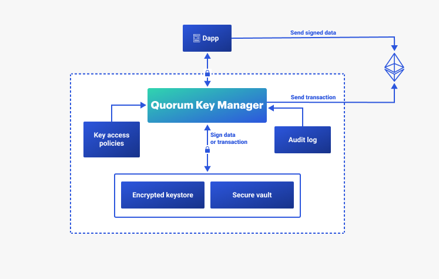

# Quorum Key Manager

## What is Quorum Key Manager?

Quorum Key Manager is an Ethereum account and key management service developed under the [BSL 1.1 license] and written in Go. Quorum Key Manager is a signing service that manages accounts, keys, and secrets for the entire Quorum stack, and supports the following vaults:

- HashiCorp Vault
- Azure Key Vault
- AWS Key Management Service

## Why use Quorum Key Manager?

Manage users' secrets, keys, and Ethereum wallets from a single API while having everything stored in a secure vault, or V3 keystores.

Manage users' access rights using customizable access policies, and audit access to your private resources.

Quorum Key Manager is compatible with GoQuorum, Hyperledger Besu, Tessera, and Codefi Orchestrate.

## Quorum Key Manager features

### Security

- Supports TLS, API-Key, OpenID Connect, and other types of authentication.
- Supports role-based access control (RBAC).
- Supports enterprise and cloud-based vaults.

### Versatility

- Supports public and private Ethereum networks.
- Supports signing public and private transactions.
- Supports [EIP-1559] transactions.
- Supports signing [Ethereum messages] and [typed data].
- Supports different elliptic curves, such as Baby Jubjub and SECP256K1; and signing algorithms, such as ECDSA and EDDSA.
- Supports secrets versioning.

<!--links-->

[BSL 1.1 license]: https://mariadb.com/bsl11/
[typed data]: https://eips.ethereum.org/EIPS/eip-712
[Ethereum messages]: https://eips.ethereum.org/EIPS/eip-191
[EIP-1559]: https://github.com/ethereum/EIPs/blob/master/EIPS/eip-1559.md
